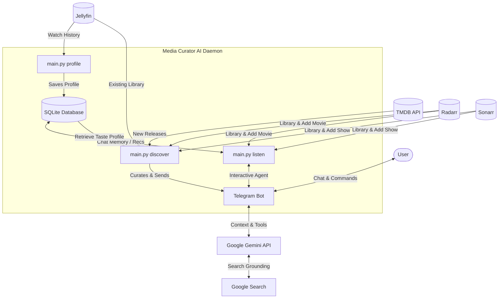

# Media Curator AI

**Media Curator AI** is an AI-driven media recommendation daemon and interactive assistant for self-hosted stacks. By seamlessly connecting **Jellyfin**, **Radarr**, **Sonarr**, and **Telegram**, it provides both a **proactive** weekly curation of new releases tailored to your viewing habits and an **interactive** conversational agent to chat with, query, and manage your personal media library on the go.

> [!WARNING]
> **Disclaimer:** This project is mostly AI-generated. You must manually review the code, scripts, and configuration before deploying or using it in your environment. Use at your own risk.

---

## 📊 System Architecture & Flow

The following diagram illustrates how the components of Media Curator AI interact with external self-hosted services and APIs:



---

## ✨ Features

- **Taste Profiler:** Automatically fetches your Jellyfin playback history (last 50 items), analyzes genres, titles, and descriptions, and leverages Google Gemini to build a highly personalized text-based taste profile stored in SQLite.
- **Hybrid Discovery:** 
  - Polls TMDB for new digital releases and popular TV shows.
  - Queries your active Jellyfin, Radarr, and Sonarr libraries to extract already-owned media IDs.
  - Filters out duplicates so you never get recommended content you already have.
  - Sends candidate movies and series to Google Gemini, which curates the top suggestions based on your unique taste profile.
- **Interactive Agentic Telegram Integration:**
  - **On-Demand Recommendations:** Trigger fresh watch-history profiling and TMDB discovery conversations on demand.
  - **Conversational Library Management:** Ask the agent to download media directly. It checks if the item is already present and adds it to Radarr or Sonarr using configured root folders and quality profiles.
  - **Genre Exploration:** Ask questions like *"What are some good recent sci-fi movies?"* or *"Suggest some thriller series"*.
  - **Detailed Lookups:** Ask details about any film or TV show (e.g., plot summaries, ratings, cast).
  - **HTML Formatting:** All Telegram interactions use Telegram-compatible HTML formatting (headers, clean lists, and code blocks) with bulletproof plain-text fallback.
- **Resilient API Handling:** Built-in connection and rate-limit retry logic with exponential backoff. Real-time warnings (such as temporary TMDB rate limits or Radarr/Sonarr connection drops) are sent to Telegram while retrying.
- **Conversation State & Context Compression:**
  - Chat history and conversation states are stored locally in SQLite to survive daemon restarts.
  - Includes **automatic 24-hour compression**: if you do not interact with the bot for 24 hours, the conversation is automatically summarized to save LLM tokens and keep responses fast. Active recommendations are dynamically injected into the system instructions, ensuring they survive compression or manual `/clear` commands so the agent never forgets them.
  - Supports manual context commands `/clear` and `/compress` (which can also be triggered conversationally).

---

## 🛠️ CLI Command Reference

Execute commands through `main.py` using the project's virtual environment:

| Command | Description | Options / Flags |
| :--- | :--- | :--- |
| `python main.py profile` | Runs the Taste Profiler to compile your Jellyfin watch history and update the SQLite database. | None |
| `python main.py discover` | Runs the weekly discovery pipeline (TMDB discovery, duplicate filtering, Gemini curation, SQLite save, and Telegram post). | `--no-telegram`: Print output to terminal instead of sending via Telegram (ideal for testing). |
| `python main.py listen` | Starts the interactive Telegram bot polling loop to listen for user chat and commands. | None |

---

## ⚙️ Environment Configuration (`.env`)

Copy `.env.example` to `.env` and fill in the following configurations:

| Variable | Description | Default / Example |
| :--- | :--- | :--- |
| `JELLYFIN_URL` | Base URL of your Jellyfin server. | `http://192.168.1.100:8096` |
| `JELLYFIN_API_KEY` | Jellyfin API Token. | `your_jellyfin_api_token` |
| `JELLYFIN_USER_ID` | Jellyfin User ID (to read watch history). | `your_jellyfin_user_id` |
| `SONARR_URL` | Base URL of your Sonarr instance. | `http://192.168.1.100:8989` |
| `SONARR_API_KEY` | Sonarr API Token. | `your_sonarr_api_token` |
| `SONARR_ROOT_FOLDER` | Destination path for imported series. | `/data/media/tv` |
| `SONARR_QUALITY_PROFILE` | ID of the quality profile for series. | `1` |
| `RADARR_URL` | Base URL of your Radarr instance. | `http://192.168.1.100:7878` |
| `RADARR_API_KEY` | Radarr API Token. | `your_radarr_api_token` |
| `RADARR_ROOT_FOLDER` | Destination path for imported movies. | `/data/media/movies` |
| `RADARR_QUALITY_PROFILE` | ID of the quality profile for movies. | `1` |
| `TMDB_API_KEY` | The Movie Database (TMDB) API Key. | `your_tmdb_api_key` |
| `GEMINI_API_KEY` | Google Gemini API Key. | `your_gemini_api_key` |
| `TELEGRAM_BOT_TOKEN` | Telegram Bot Token (from `@BotFather`). | `your_telegram_bot_token` |
| `TELEGRAM_CHAT_ID` | Your Telegram personal chat ID. | `your_telegram_chat_id` |
| `DISCOVERY_SCHEDULE` | Systemd schedule expression for discovery. | `Thu 17:00:00` |

---

## 💾 SQLite Database & Persistence

The project initializes an SQLite database (`media_curator.db`) at startup with the following tables:

1. `taste_profile`: Stores your generated taste profile string, updated whenever `main.py profile` runs.
2. `active_recommendations`: Stores TMDB IDs, titles, and order (positions 1-5) of the latest curated list. This enables short Telegram commands like *"Download #2"*. The active list is dynamically injected into Gemini's system instructions and processed natively via the `download_active_recommendation` tool to prevent context loss.
3. `processed_items`: Contains IDs of already-curated or manually added recommendations to prevent duplicate suggestions in future discovery cycles.
4. `chat_history`: Keeps track of persistent user and model conversational turns.
5. `chat_state`: Stores key-value configurations, such as `compressed_context` summaries and the `last_interaction_time`.

---

## 📦 Proxmox LXC Installation

If you are running Proxmox VE, you can use the automated installer. Run this command on your **Proxmox host**:

```bash
# Using curl (recommended and standard on Proxmox)
bash -c "$(curl -fsSL https://raw.githubusercontent.com/ClemensSchartmueller/MediaCuratorAI/main/proxmox/lxc_install.sh)"

# Or using wget
bash -c "$(wget -qO- https://raw.githubusercontent.com/ClemensSchartmueller/MediaCuratorAI/main/proxmox/lxc_install.sh)"

# Or using GitHub CLI (for private/authenticated access)
bash -c "$(gh api -H "Accept: application/vnd.github.raw" /repos/ClemensSchartmueller/MediaCuratorAI/contents/proxmox/lxc_install.sh)"
```

Alternatively, if you have the repo cloned locally on the host:
```bash
bash proxmox/lxc_install.sh
```

### Updating the LXC Container

The Proxmox LXC setup supports the standard Proxmox VE Helper-Scripts update mechanisms for both the application and the container operating system:

1. **Manual Application Updates**:
   Type `update` in the LXC container's console to update the application to the latest version:
   ```bash
   update
   ```

2. **Automated / Multi-Container Application Updates**:
   Use the community's `update-apps.sh` script on your **Proxmox Host** to automatically update all managed LXC containers (including Media Curator):
   ```bash
   bash -c "$(curl -fsSL https://raw.githubusercontent.com/community-scripts/ProxmoxVE/main/tools/pve/update-apps.sh)"
   ```

3. **Container Operating System Updates**:
   Use the PVE LXC Updater (`update-lxcs.sh`) on your **Proxmox Host** to upgrade the container operating system packages (unattended/dist-upgrade):
   ```bash
   bash -c "$(curl -fsSL https://raw.githubusercontent.com/community-scripts/ProxmoxVE/main/tools/pve/update-lxcs.sh)"
   ```

4. **Updating Private Installations from the Proxmox Host**:
   If the repository is private and was installed/cloned using `gh` (GitHub CLI), you can authenticate and run the update from your Proxmox Host:
   - **Step 1:** Authenticate the container's GitHub CLI using your host's active token:
     ```bash
     pct exec <CTID> -- bash -c "echo '\$(gh auth token)' | gh auth login --with-token"
     ```
   - **Step 2:** Link the Git credential helper to the GitHub CLI inside the container:
     ```bash
     pct exec <CTID> -- gh auth setup-git
     ```
   - **Step 3:** Trigger the update:
     ```bash
     pct exec <CTID> -- update
     ```

---

## 🔧 Manual Setup (Linux/Unix/Windows)

1. **Clone & Install:**
   ```bash
   # Using git
   git clone https://github.com/ClemensSchartmueller/MediaCuratorAI.git /opt/media-curator

   # Or using GitHub CLI
   gh repo clone ClemensSchartmueller/MediaCuratorAI /opt/media-curator

   cd /opt/media-curator ; python3 -m venv venv
   # On Linux/macOS
   source venv/bin/activate ; pip install -r requirements.txt
   # On Windows
   .venv\Scripts\activate ; pip install -r requirements.txt
   ```

2. **Configure:**
   Copy `.env.example` to `.env` and fill in your API keys and URLs.
   
   **Setting up Telegram Bot:**
   1. Open Telegram and search for [@BotFather](https://t.me/BotFather).
   2. Send `/newbot` and follow the instructions to create a bot. Copy the bot token provided.
   3. Search for your bot in Telegram and start a chat by clicking **Start** or sending a message.
   4. Search for [@userinfobot](https://t.me/userinfobot) and message it to find your Telegram Chat ID, or visit `https://api.telegram.org/bot<YOUR_BOT_TOKEN>/getUpdates` to find the chat ID from the message you sent to your bot.
   5. Put these values in your `.env` file under `TELEGRAM_BOT_TOKEN` and `TELEGRAM_CHAT_ID`.

3. **Database Setup:**
   The SQLite database is initialized automatically on the first command run.

4. **Initial Profile Generation:**
   Create your taste profile by analyzing your Jellyfin library playback history:
   ```bash
   python main.py profile
   ```

5. **Service Setup & Scheduling (systemd):**
   Copy the systemd service files and set up automatic discovery:
   ```bash
   cp deployment/media-curator.service /etc/systemd/system/
   cp deployment/media-curator-discovery.service /etc/systemd/system/
   
   DISCOVERY_SCHEDULE=$(grep -E '^DISCOVERY_SCHEDULE=' .env | cut -d '=' -f2- | tr -d '"')
   DISCOVERY_SCHEDULE="${DISCOVERY_SCHEDULE:-Thu 17:00:00}"
   sed "s|OnCalendar=.*|OnCalendar=${DISCOVERY_SCHEDULE}|" deployment/media-curator-discovery.timer > /etc/systemd/system/media-curator-discovery.timer
   
   systemctl daemon-reload
   systemctl enable --now media-curator.service
   systemctl enable --now media-curator-discovery.timer
   ```

   **Applying a schedule change:**
   1. Edit `DISCOVERY_SCHEDULE` in `/opt/media-curator/.env`.
   2. Run `update` inside the container (or `pct exec <CTID> -- update` from the host).

   **Alternative Cron setup:**
   If you prefer using cron instead of systemd:
   ```cron
   # Weekly discovery (Thursdays at 5 PM)
   0 17 * * 4 cd /opt/media-curator ; ./venv/bin/python main.py discover

   # Monthly profile refresh (1st of every month at 2 AM)
   0 2 1 * * cd /opt/media-curator ; ./venv/bin/python main.py profile
   ```

---

## 🧑‍💻 Developer & Contributor Guide

If you are setting up a development environment or running tests, follow these steps:

### Setup & Seeding
Use the automated developer environment setup script (installs developer requirements and initializes a local SQLite database seeded with authentic dummy watch history/taste profiles):
```bash
# Setup the VM/dev environment
bash setup_jules.sh
```

### Makefile Targets
Common tasks can be executed easily using the `Makefile`:

- **Run all unit tests:**
  ```bash
  make test
  ```
  *(Or execute manually: `python3 -m unittest discover tests`)*

- **Auto-format code:**
  ```bash
  make format
  ```

- **Run linter:**
  ```bash
  make lint
  ```

- **Run mock pipeline (no Telegram output):**
  ```bash
  make run-test-discovery
  ```
  *(Or execute manually: `python3 main.py discover --no-telegram`)*

---

## 📋 Requirements

- Python 3.11+
- Radarr & Sonarr
- Jellyfin Server
- TMDB API Key
- Google Gemini API Key
- Telegram Bot Token & Chat ID

---

## 📄 License

This project is licensed under the MIT License - see the [LICENSE](LICENSE) file for details.
